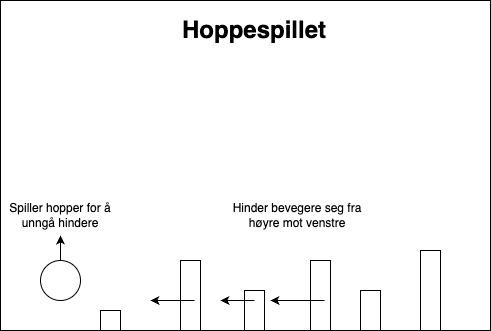

# Problemløsning

## Metoder, teknikker og verktøy

- Systemutvikling
  - Smidig metodikk
  - Fossefallsmetoden
  - Testdrevet utvikling
  - [Aunivers: 2B Systemutvikling - Systemutviklingsmetoder](https://aunivers.no/fagpakker/realfag/informasjonsteknologi-1-2/it-2/2-objektorientert-programmering/2b-systemutvikling/systemutviklingsmetoder)

## Alternative løsninger

- Kommer snart..

## Objektorienterte programmer med klasser, arv og objekter

### Gjøremål:

1. Tegn UML-diagram av Hoppespillet, der spiller og hindere arver fra en figur-klasse
2. Opprett klassene i Python, du trenger ikke implementere metodene enda
3. Dokumenter klassene med [docstrings (/impementering/readme.md#gjenbrukbar-kode)](../implementering/readme.md#gjenbrukbar-kode)
4. Kopier [Pygame-eksemplene (/pygame/readme.md)](../pygame/readme.md) inn i egne .py-filer og studer koden
5. Lag hoppespillet
6. Lag ditt eget spill med Pygame
   - Du velger selv om du vil starte helt på nytt eller fortsette på Hoppespillet.

### Ressurser

- Klasser og metoder
  - [Aunivers: 2A Klasser og objekter - Klasser](https://aunivers.no/fagpakker/realfag/informasjonsteknologi-1-2/it-2/2-objektorientert-programmering/2a-klasser-og-objekter/klasser)
  - [Aunivers: 2A Klasser og objekter - Metoder](https://aunivers.no/fagpakker/realfag/informasjonsteknologi-1-2/it-2/2-objektorientert-programmering/2a-klasser-og-objekter/metoder)
- Arv
  - [Aunivers: 2A Klasser og objekter - Arv](https://aunivers.no/fagpakker/realfag/informasjonsteknologi-1-2/it-2/2-objektorientert-programmering/2a-klasser-og-objekter/arv)
- Bruken av objekter i sammensatte programmer
  - [Aunivers: 2A Klasser og objekter - Organisere flere objekter](https://aunivers.no/fagpakker/realfag/informasjonsteknologi-1-2/it-2/2-objektorientert-programmering/2a-klasser-og-objekter/organisere-flere-objekter)

## Vurderingskriterier

| Kategori           | Lav kompetanse (2)                                                                                                               | God kompetanse (4)                                                                                                            | Utmerket kompetanse (6)                                                                                               |
| ------------------ | -------------------------------------------------------------------------------------------------------------------------------- | ----------------------------------------------------------------------------------------------------------------------------- | --------------------------------------------------------------------------------------------------------------------- |
| **Problemløsning** | forstår og bruke enkle metoder, teknikker og verktøy                                                                             | forstår og bruke sammensatte metoder, teknikker og verktøy                                                                    | hensiktsmessig anvende avanserte metoder, teknikker og verktøy                                                        |
|                    | beskriver alternative løsninger                                                                                                  | forklarer alternative løsninger og tilpasser dem for å oppnå forbedringer                                                     | grundig vurderer alternative løsninger og gjøre hensiktsmessige valg                                                  |
|                    | designer og utformer objektorienterte programmer med klasser med hensiktsmessige egenskaper og objekter basert på disse klassene | designer og utformer objektorienterte programmer med klasser med hensiktsmessige metoder og objekter basert på disse klassene | designer og utformer objektorienterte programmer med klasser med hensiktsmessig arv og objekter basert på de klassene |
